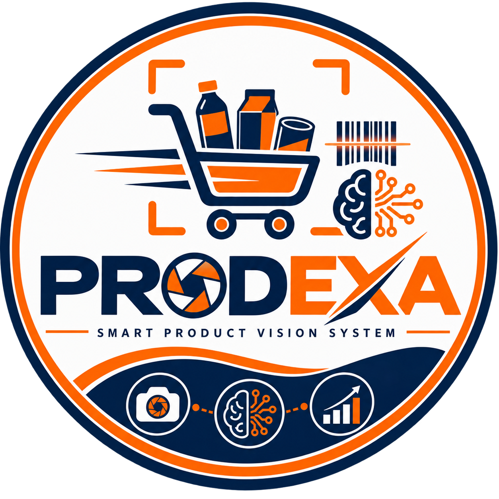

# Prodexa

<p align="center">
  
</p>

<h3 align="center">Smart Product Vision & Analysis System</h3>

<p align="center">
  <strong>PROD</strong>uct <strong>EX</strong>amination & <strong>A</strong>nalysis
</p>

<p align="center">
  An image-processing-based system for detecting, classifying, counting and statistically analyzing supermarket products from images.
</p>

<p align="center">
  
  
  
  
  
</p>

---
<br>

## 🧠 About Prodexa

**PRODEXA (PRODuct EXamination & Analysis)** is an image processing based smart supermarket product identification system developed for **EC9570: Digital Image Processing**, Department of Computer Engineering, University of Jaffna.

The system is designed to transform a supermarket basket or product-layout image into structured product information by combining image acquisition, image preprocessing, product segmentation, object detection, product classification, counting and statistical analysis.

The overall objective is to demonstrate how **Digital Image Processing and Computer Vision techniques** can be integrated into a practical smart-checkout-oriented application.

---
<br>

## 📌 Overview

Given an image of a supermarket basket / product layout, the system:

1. Preprocesses the image (noise removal, resizing, normalization)
2. Detects and segments individual products
3. Classifies each product into a category
4. Generates a statistical summary report (counts, percentages, charts)
5. Displays results as labeled bounding boxes on the image and/or console output

Real-time capture is not used; the system works on pre-collected / manually captured images.

All processing is performed **locally** (no cloud APIs).

---
<br>

## ✨ Key Features

| Feature                    | Description                                                             |
| -------------------------- | ----------------------------------------------------------------------- |
| 🖼️ Image Acquisition      | Accepts supermarket basket and product-layout images                    |
| ⚙️ Preprocessing           | Resizing, noise removal, normalization and color-space processing      |
| 🎯 Product Segmentation    | Separates product regions from the background                           |
| 🔍 Object Detection        | Identifies individual product regions using image-processing techniques |
| 🏷️ Product Classification | Assigns detected products to predefined categories                      |
| 🔢 Product Counting        | Calculates total and category-wise product counts                       |
| 📊 Statistical Analysis    | Generates category percentages and distribution information             |
| 📈 Visualization           | Supports bar charts and pie charts                                      |
| 🏷️ Annotated Output       | Displays detected products using bounding boxes and labels              |
| 🔒 Local Processing        | Performs processing locally without cloud-based inference               |

---
<br>

## 🎯 Project Objectives

The main objectives of Prodexa are to:

* Develop an image-processing-based supermarket product identification pipeline.
* Apply preprocessing techniques to improve image quality and consistency.
* Isolate individual products from supermarket images.
* Detect product regions using segmentation and object-detection techniques.
* Classify detected products into meaningful categories.
* Calculate total and category-wise product counts.
* Generate statistical summaries and visualizations.
* Evaluate classification performance against the required accuracy target.
* Demonstrate modular and collaborative software development using GitHub.

---
<br>

## ⚙️ Dataset

**[RPC: Retail Product Checkout Dataset](https://www.kaggle.com/datasets/diyer22/retail-product-checkout-dataset)**

(Wei et al., 200 SKUs across 17 meta-categories, ~83,739 images, COCO-format bounding box annotations, ~20GB).

The dataset contains two main image types:

### Exemplar Images

Single-product images captured against a clean/plain background and from multiple viewing angles.

**Purpose:**

* Training the classification module
* Validating the classification module
* Extracting product-level visual characteristics

### Checkout Images

Images containing multiple products placed on a checkout tray with different levels of visual clutter.

The checkout images include:

* **Easy** - 3-5 categories / 3-10 instances
* **Medium**
* **Hard**

These images are used for testing:

* Product detection
* Product segmentation
* Full end-to-end pipeline performance

### Category Strategy

Classification targets the dataset's **17 meta-categories** (e.g. bottle-like, box-like, canister-like, bag-like) rather than all 200 fine-grained SKUs.

These categories are visually distinguishable by shape, color and texture and are therefore better suited to a classical image-processing pipeline within the project's scope.

### Project Dataset Scope

Due to the **12-hour project limit**, a curated subset of the complete dataset is used rather than the entire dataset.

The project uses:

* A sample of exemplar images per meta-category for classification training/testing
* **Easy-difficulty checkout images** for detection, segmentation and the full pipeline demonstration

Higher clutter levels involve heavy occlusion, which conflicts with the assignment's **"clearly separated products preferred"** scope.

> **Note:** The complete dataset (~20GB) is **not stored in this repository**. See [Getting the Dataset](#getting-the-dataset).

---
<br>

## 🔄 System Workflow

```text
                    ┌──────────────────────┐
                    │    Input Image       │
                    │ Basket / Layout      │
                    └──────────┬───────────┘
                               │
                               ▼
                    ┌──────────────────────┐
                    │ Image Acquisition    │
                    └──────────┬───────────┘
                               │
                               ▼
                    ┌──────────────────────┐
                    │   Preprocessing      │
                    │ Resize • Denoise     │
                    │ Normalize • HSV      │
                    └──────────┬───────────┘
                               │
                               ▼
                    ┌──────────────────────┐
                    │    Segmentation      │
                    │ Thresholding         │
                    │ Morphology           │
                    └──────────┬───────────┘
                               │
                               ▼
                    ┌──────────────────────┐
                    │   Object Detection   │
                    │ Contours • Filtering │
                    │ Bounding Boxes       │
                    └──────────┬───────────┘
                               │
                               ▼
                    ┌──────────────────────┐
                    │ Feature Extraction   │
                    │ Color • Shape        │
                    │ Texture              │
                    └──────────┬───────────┘
                               │
                               ▼
                    ┌──────────────────────┐
                    │    Classification    │
                    │     SVM / KNN        │
                    └──────────┬───────────┘
                               │
                               ▼
                    ┌──────────────────────┐
                    │ Counting & Statistics│
                    │ Counts • Percentages │
                    └──────────┬───────────┘
                               │
                               ▼
                    ┌──────────────────────┐
                    │   Final Visualization│
                    │ Labels • Boxes •     │
                    │ Charts • Summary     │
                    └──────────────────────┘
```

### Core Pipeline

```text
Raw Image
    ↓
Preprocessing
    ↓
Segmentation
    ↓
Product Detection
    ↓
Feature Extraction
    ↓
Classification
    ↓
Product Counting
    ↓
Statistical Analysis
    ↓
Annotated Output + Charts
```

---
<br>

## 👥 Team

| Member                    | Modules Owned                                                             |
| ------------------------- | ------------------------------------------------------------------------- |
| **De Costa M.S.M.**       | Image Acquisition & Preprocessing, Product Classification                 |
| **Senarathna S.A.D.H.D.** | Object Detection & Segmentation, Statistical Analysis & Report Generation |

### Collaborative Module Flow

```text
                 MEMBER 01
                     │
          Image Acquisition
                     ↓
              Preprocessing
                     │
                     ▼
                 MEMBER 02
                     │
              Segmentation
                     ↓
             Object Detection
                     ↓
              Product Crops
                     │
                     ▼
                 MEMBER 01
                     │
             Feature Extraction
                     ↓
              Classification
                     │
                     ▼
                 MEMBER 02
                     │
             Product Counting
                     ↓
            Statistical Analysis
                     ↓
             Report Generation
```

This modular division allows both members to work independently while maintaining clear interfaces between the system components.

---
<br>

## 🧠 Techniques Used

### Preprocessing

* Resizing
* Gaussian / median blur
* Color-space conversion
* Lighting normalization
* Image normalization

### Segmentation

* Thresholding
* HSV-based background masking
* Morphological operations
* Contour detection

### Object Detection

* Contour-based object detection
* Contour-area filtering
* Bounding-box extraction
* Product-region isolation

### Feature Extraction

* Color features
* Shape features
* Texture features

### Classification

* *(Fill in once decided: handcrafted features + ML classifier, or pretrained CNN feature extractor + shallow classifier with justification, since pretrained models must be explained as required by the assignment)*

### Statistical Analysis

The system generates:

* Total product count
* Category-wise product counts
* Percentage distribution
* Bar charts
* Pie charts

---
<br>

## 🏗️ Project Structure

```text
PRODEXA/
│
├── README.md
├── LICENSE
├── requirements.txt
├── .gitignore
│
├── assets/
│   └── prodexa-logo.png
│
├── data/
│   ├── raw/                  # RPC dataset subset - git-ignored
│   ├── annotations/          # COCO-format bounding box JSON - git-ignored
│   ├── processed/            # Preprocessed images
│   ├── dataset/              # Cropped product images organized by meta-category
│   └── dataset_subset.txt    # Exact files used from the full RPC dataset
│
├── notebooks/
│
├── src/
│   ├── acquisition/
│   ├── preprocessing/
│   ├── segmentation/
│   ├── detection/
│   ├── features/
│   ├── classification/
│   ├── analytics/
│   ├── visualization/
│   └── pipeline/
│
├── models/                   # Trained classifier artifacts
│
├── outputs/
│   ├── annotated_images/     # Bounding boxes + labels
│   └── reports/              # Summary tables / charts
│
├── docs/                     # Documentation 
│
└── tests/                    # Module-level tests
```

---
<br>

## 🔗 Module Integration

Prodexa follows a modular architecture where each component has a clearly defined responsibility.

```text
Acquisition
     │
     ▼
Preprocessing
     │
     ▼
Segmentation
     │
     ▼
Detection
     │
     ▼
Feature Extraction
     │
     ▼
Classification
     │
     ▼
Analytics
     │
     ▼
Visualization
```

The final integration layer connects these modules into a single end-to-end processing pipeline.

---
<br>

## 📊 Statistical Output

For every processed supermarket image, Prodexa aims to provide:

```text
         PRODEXA ANALYSIS

Total Products Detected: 6

Category             Count       %
----------------------------------------
Category A              2       33.33%
Category B              2       33.33%
Category C              1       16.67%
Category D              1       16.67%

----------------------------------------
Total                   6      100.00%
----------------------------------------
```

The system can additionally generate:

* Category distribution bar chart
* Category distribution pie chart
* Annotated product image
* Classification evaluation results

---
<br>

## 📈 Evaluation

The classification module will be evaluated using an independent test set.

### Primary Metric

**Classification Accuracy**

```text
Accuracy =
Correct Predictions
──────────────────── × 100
Total Predictions
```

### Target

> **Classification accuracy ≥ 80%**

Additional evaluation metrics may include:

* Precision
* Recall
* F1-score
* Confusion matrix

| Metric                  |                Value |
| ----------------------- | -------------------: |
| Classification accuracy | *TBD (target ≥ 80%)* |
| Categories              |                *TBD* |
| Test images             |                *TBD* |

---
<br>

## 🎓 Course Information

**EC9570 - Digital Image Processing**

**Department of Computer Engineering**
**Faculty of Engineering**
**University of Jaffna**

This project is developed as part of the EC9570 Digital Image Processing coursework.

---
<br>

<p align="center">
  <strong>Prodexa</strong><br>
  <em>From Pixels to Product Insights.</em>
</p>

<p align="center">
  EC9570 • Digital Image Processing • University of Jaffna
</p>
